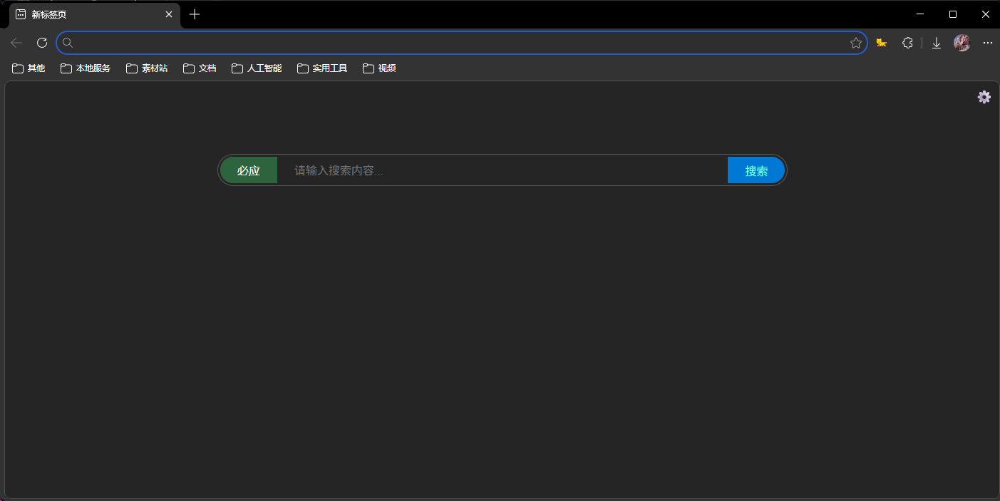
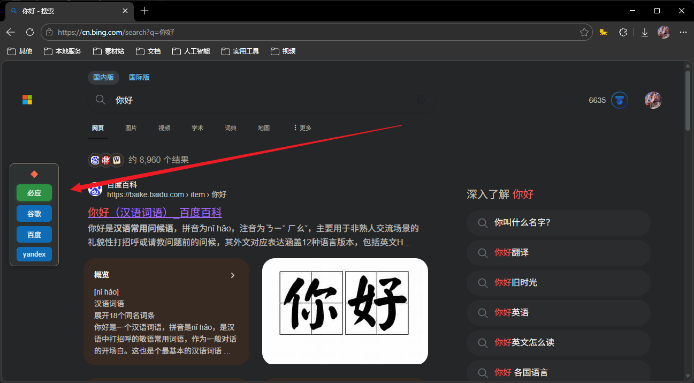

# 新标签页扩展 - 多引擎搜索工具条

一个美观实用的 Microsoft Edge 浏览器新标签页扩展，带有强大的**多引擎搜索切换工具条**功能，让您在搜索结果页面快速切换不同搜索引擎。




## ✨ 核心功能

### 🔍 多搜索引擎支持
- 内置 6 个主流搜索引擎：必应、谷歌、百度、搜狗、360、Yandex
- 支持自定义添加任意搜索引擎
- 搜索引擎 URL 使用 `%d` 作为搜索词占位符

### 🎯 多引擎切换工具条（特色功能）
- 在搜索结果页面显示悬浮工具条
- 一键切换不同搜索引擎，使用相同关键词重新搜索
- 支持横向/竖向布局切换（点击 🔶 按钮）
- 工具条位置可拖动，自动保存位置
- 支持深色/浅色主题自动适配

### 🎨 个性化定制
- **主题设置**: 深色/浅色模式切换
- **搜索框样式**:
  - 宽度调整 (400-800px)
  - 高度调整 (30-100px)
  - 圆角大小 (0-30px)
  - 字体大小 (12-24px)
  - 顶部间距 (0-窗口高度/2)
- **搜索行为**: 搜索结果在当前标签页或新标签页打开

### ⌨️ 快捷键支持
- `Ctrl + K` / `Alt + S` - 快速聚焦搜索框

## 📦 安装步骤

### 方法一：开发者模式安装（推荐）

1. **打开 Edge 扩展管理页面**
   - 在地址栏输入 `edge://extensions/` 并回车

2. **开启开发者模式**
   - 打开页面右上角的"开发者模式"开关

3. **加载扩展**
   - 点击"加载解压的扩展"按钮
   - 选择本项目的文件夹

4. **完成安装**
   - 扩展加载成功，打开新标签页即可看到效果

### 方法二：打包安装

1. 使用 `package_extension.bat` 脚本打包扩展
2. 在扩展管理页面拖拽 ZIP 文件进行安装

## 🚀 使用指南

### 启用多引擎切换工具条

1. 打开新标签页，点击右上角的 ⚙️ 设置按钮
2. 在"搜索行为设置"区域，找到"多引擎切换工具条"
3. 选择"开启 (在搜索结果页显示)"
4. 关闭设置面板

### 使用工具条

1. **进行搜索**
   - 在新标签页输入关键词并搜索

2. **切换搜索引擎**
   - 在搜索结果页面，右上角会显示工具条
   - 点击任意引擎按钮，立即切换到该引擎搜索相同关键词

3. **调整布局**
   - 点击 🔶 按钮切换横向/竖向布局
   - 拖动工具条空白区域调整位置

4. **关闭工具条**
   - 在设置中关闭"多引擎切换工具条"选项

### 管理搜索引擎

1. 打开设置面板
2. 滚动到"搜索引擎管理"区域
3. 可以执行以下操作：
   - **添加**: 点击"添加搜索引擎"，输入名称和 URL
   - **编辑**: 点击引擎的"编辑"按钮修改信息
   - **删除**: 点击引擎的"删除"按钮移除

## 🛠️ 技术规格

### 文件结构
```
新标签页/
├── index.html              # 主页面（新标签页 UI）
├── script.js               # 新标签页 JavaScript 逻辑
├── content.js              # 搜索结果页面注入脚本
├── manifest.json           # 扩展配置文件 (Manifest V3)
├── icon/                   # 图标目录
│   ├── icon16.png
│   ├── icon48.png
│   └── icon128.png
├── assets/                 # 项目截图
├── README.md               # 本说明文档
├── INSTALL_GUIDE.md        # 详细安装指南
├── test_server.bat         # 本地测试服务器脚本
├── package_extension.bat   # 扩展打包脚本
└── generate_icons.py       # 图标生成脚本
```

### 技术栈
- **前端**: HTML5 + CSS3 + Vanilla JavaScript
- **扩展规范**: Chrome Extension Manifest V3
- **数据存储**: chrome.storage.local + localStorage
- **Content Script**: 在搜索结果页面注入工具条

### 支持的搜索引擎 URL 格式
```javascript
{
  name: "搜索引擎名称",
  url: "https://example.com/search?q=%d"  // %d 为搜索词占位符
}
```

### 支持的搜索引擎域名
工具条会在以下搜索引擎页面自动加载：
- `cn.bing.com` - 必应搜索
- `www.google.com` - 谷歌搜索
- `www.baidu.com` - 百度搜索
- `www.sogou.com` - 搜狗搜索
- `www.so.com` - 360 搜索
- `yandex.com` - Yandex 搜索

## 🔧 开发指南

### 本地测试

1. 运行测试服务器：
   ```bash
   test_server.bat
   ```

2. 访问 `http://localhost:8000/index.html` 预览界面

### 生成图标

如果图标文件缺失，可以使用 Python 脚本生成：

```bash
pip install Pillow
python generate_icons.py
```

### 打包扩展

```bash
package_extension.bat
```

生成 `CustomNewTabPage.zip` 文件用于分发。

## 📝 数据存储说明

扩展使用 `chrome.storage.local` 存储以下数据：

| 配置项 | 键名 | 默认值 |
|--------|------|--------|
| 主题 | `theme` | 'light' |
| 搜索框宽度 | `searchBoxWidth` | '600px' |
| 搜索框高度 | `searchBoxHeight` | '40' |
| 圆角大小 | `searchBoxRadiusSize` | '0' |
| 字体大小 | `searchBoxFontSize` | '16' |
| 顶部间距 | `searchBoxTopHeight` | '0' |
| 打开方式 | `searchTarget` | '_blank' |
| 多引擎模式 | `multiEngineMode` | 'off' |
| 当前引擎 | `searchEngine` | 第一个引擎 |
| 引擎列表 | `searchEngineList` | 内置 6 个引擎 |
| 工具条位置 | `toolbarLeft` / `toolbarTop` | 右上角 |
| 工具条方向 | `toolbarDirection` | 'horizontal' |

## ⚠️ 注意事项

1. **权限需求**: 扩展需要 `storage` 权限保存设置
2. **地址栏显示**: 启动时地址栏会显示 `extension://` URL，属正常现象
3. **本地存储**: 所有数据存储在本地，不会上传到服务器
4. **浏览器兼容**: 基于 Chromium 的浏览器（Edge、Chrome 等）

## 🐛 故障排除

### 工具条不显示
1. 确认已在设置中开启"多引擎切换工具条"
2. 确认访问的是支持的搜索引擎页面
3. 检查浏览器控制台是否有错误信息
4. 尝试刷新扩展（`edge://extensions/` → 刷新按钮）

### 工具条无法拖动
1. 确保拖动的是工具条空白区域，不是按钮
2. 检查浏览器控制台是否有错误
3. 尝试刷新页面

### 设置不保存
1. 检查浏览器是否允许扩展使用存储权限
2. 查看控制台是否有存储相关错误
3. 尝试重置扩展（删除后重新加载）

### 搜索引擎无法切换
1. 确认搜索引擎 URL 格式正确（包含 `%d` 占位符）
2. 检查网络连接
3. 尝试删除并重新添加该搜索引擎

## 📄 许可证

本项目仅供学习和个人使用。

## 🙏 致谢

感谢使用本扩展！如有问题或建议，欢迎反馈。
